# Fast API CRUD Operations
This project outlines how to use **CRUD (CREATE, READ, UPDATE, DELETE)** operations for Fast API projects.  
The routes/endpoints constructed in this project are based on the 2023 NBA Finals teams/players. Enjoy!  

**Prerequisites**: You will need to setup your environment before you can begin using Fast API. Below are the requirments:
* Setup ***"venv"*** in your working directory. `python -m venv nameOfEnvironment` (Ex: **python -n venv fastapienv**)
* Install the requirements.txt via pip: `pip install -r requirements.txt`
* Run the command: `uvicorn main:app --reload` to start running the app.  
  The ***--reload*** switch ensures you don't have to restart the application as you're making updates. Just simply refresh the page and you will see the updates accordingly.

**NOTE:** **Since this project is just meant to showcase API CRUD operations will will not be using a database.  For the purposes of testing we will be using a Python List.**

```python
nba_finals_players = [
    {'name': 'Jamal Murray', 'team':'Denver Nuggets', 'position':'guard'},
    {'name': 'Nikola Jokic', 'team': 'Denver Nuggets', 'position': 'center'},
    {'name': 'Jimmy Butler', 'team': 'Miami Heat', 'position': 'forward'},
    {'name': 'Bam Adebayo', 'team': 'Miami Heat', 'position': 'center'}
]
```

## Working with FastAPI Docs
After running the ***uvicorn*** command, launch your browser and enter this URL address: **localhost:8000/docs**  
From there you will be to view a live page of all API routes/endpoints.  

FastAPI provides built-in support for Swagger UI integration, which allows you to automatically generate interactive documentation for your API based on your code. 

Below are the routes we will be working with from this app:
* (GET) /players
* (GET) /players/{player_name}
* (GET) /players/
* (GET) /players/by_position/{selected_position}
* (POST) /players/add_player
* (PUT) /players/update_player
* (DELETE) /players/delete_player/{player_name}


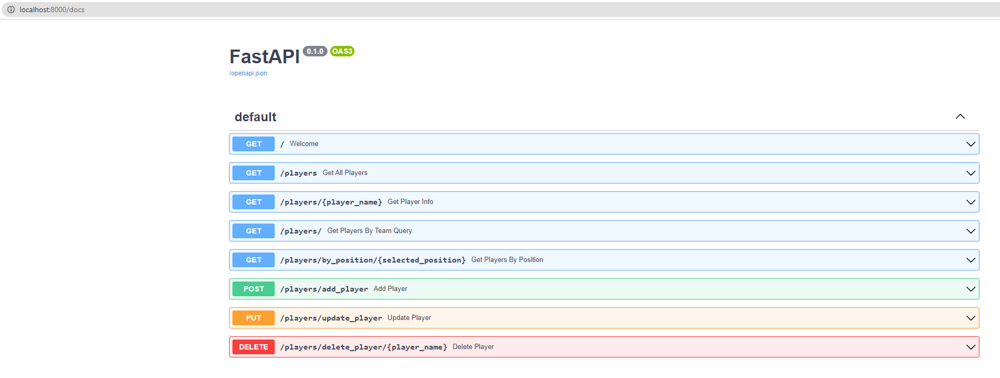


### Default Route
When viewing the app via the default route: `localhost:8000` you will be greeted with a welcome message:

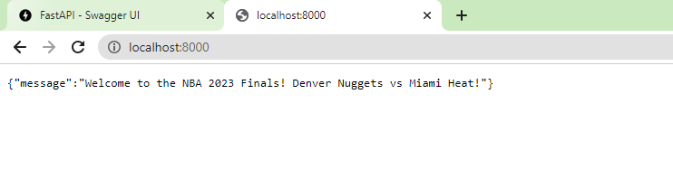

Below is the ***welcome endpoint*** defined: 
```python
@app.get("/")
async def welcome():
    return {'message': 'Welcome to the NBA 2023 Finals! Denver Nuggets vs Miami Heat!'}
```

One of the benefits of using the Swagger UI is you can also view the body output via the docs page.  
Proceed with expanding the **first (GET) route "/"** and then click the **"Try it out"** button, followed by **Execute**.  
From there you will see the json body output:
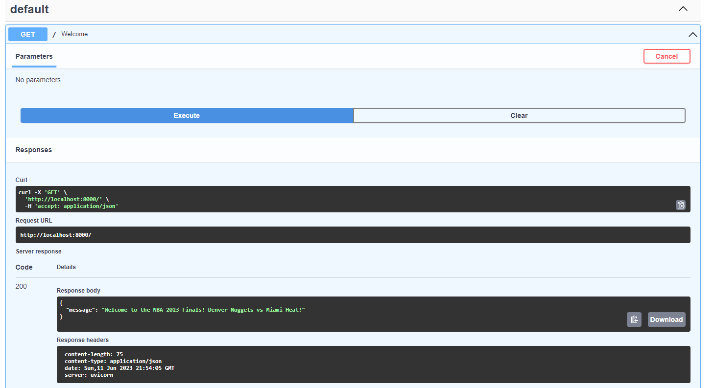

## (GET) /players
When using this route, it will showcase the two superstar players on each of the respective teams in the 2023 NBA Finals.

Here is the **get_all_players endpoint** defined:
```python
@app.get("/players")
async def get_all_players():
    return nba_finals_players
```

Below is the output you will see for the ***"/players"*** route via Swagger UI:

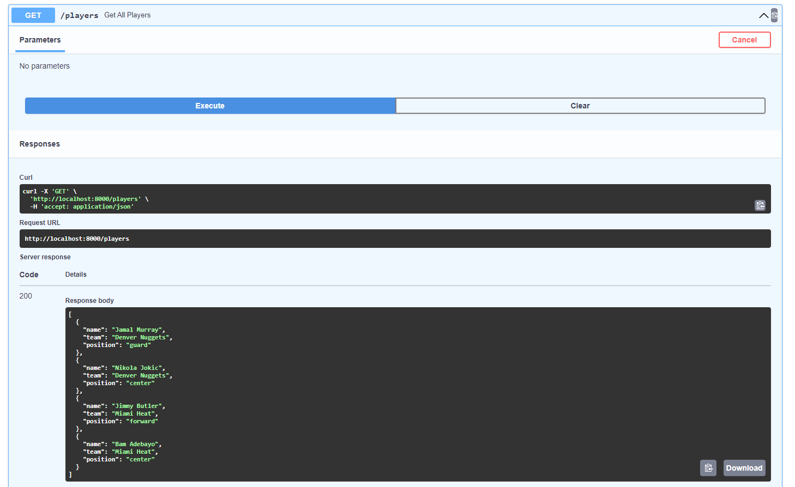

## (GET) /players/{player_name}
For this route ***"/players/{player_name}"***, we are showcasing the use of **path parameters**.  
This allows for dynamic routing, where different values can be passed in the URL to represent different rourses or entities.  
This enables the creation of flexible and customizable routes in our API. For instance, a path parameter can represent a specific user ID or a product code, allowing you to retreive or manipulate resources based on the provided parameter.  

In our case, we want to get the info on a single basketball player. Below is the **get_player_info endpoint** which will take in a value in order to accomplish this:  
```python
@app.get("/players/{player_name}")
async def get_player_info(player_name: str):
    for player in nba_finals_players:
        if player.get('name').casefold() == player_name.casefold():
            return player
```

Here's the output after inputting the value ***"Jamal Murray"***:

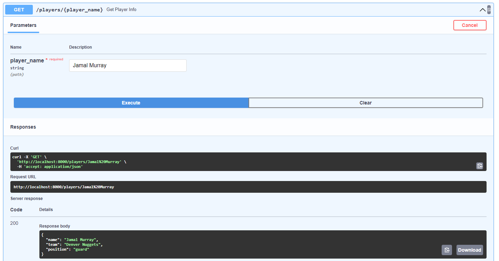

## (GET) /players/
The route **"/players/"** showcases the use of query parameters. Query parameters allow for flexible API requests by providing optional parameters that can be included/excluded based on the client's needs. 

In this example, we want to get all the players associated from one of the teams. Here's our endpoint defined:

```python
@app.get("/players/")
async def get_players_by_team_query(team: str):
    players_by_team_return = []
    for player in nba_finals_players:
        if player.get('team').casefold() == team.casefold():
            players_by_team_return.append(player)
    return players_by_team_return
```

Below is the output:

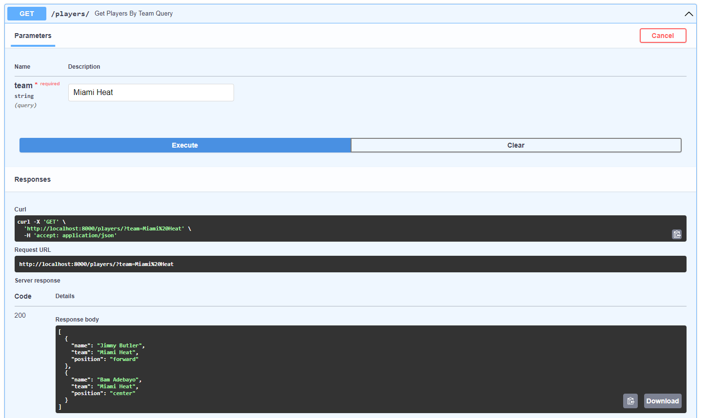

## (GET) /players/by_position/{selected_position}
For the route **"/players/by_position/{selected_position}"** we will be using path parameters again and this time, we would like to get all the players available based on the position they play on the court. 

Here is the **get_players_by_position endpoint** defined:
```python
@app.get("/players/by_position/{selected_position}")
async def get_players_by_position(selected_position: str):
    selected_position_return = []
    for player in nba_finals_players:
        if player.get('position').casefold() == selected_position.casefold():
            selected_position_return.append(player)
    return selected_position_return
```

Below is the response body when entering the value **"center"**:

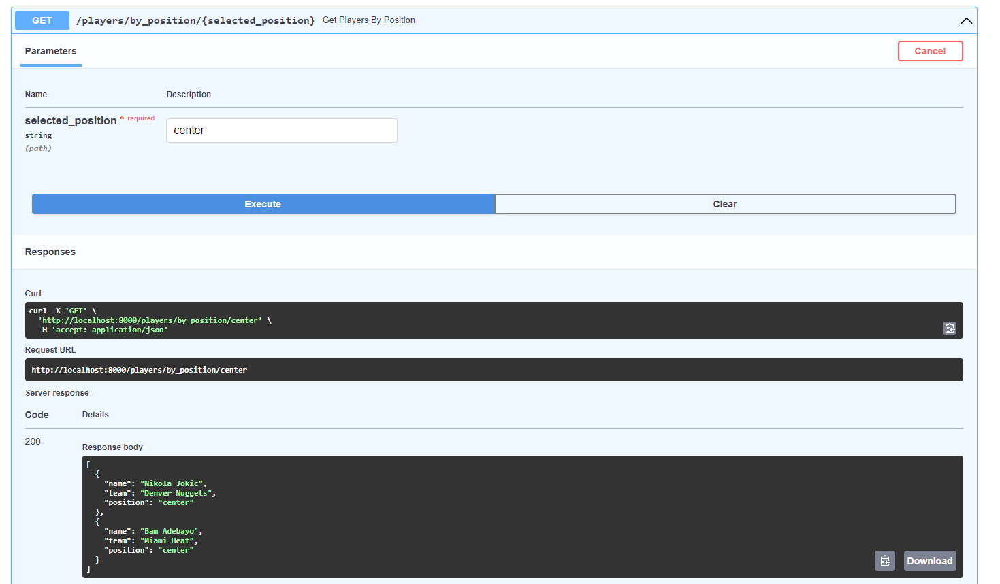

## (POST) /players/add_player
For this route **"/players/add_player"** we will start to use the HTTP **POST Method to create/add a player** to the list. 

Below is the **add_player endpoint** defined:
```python
@app.post("/players/add_player")
async def add_player(new_player=Body()):
    nba_finals_players.append(new_player)
```

Within the endpoint definition we are using the ***Body() method***. This method is typically used as a parameter in the function signature of a FastAPI endpoint.  
It is used to describe the structure and data type of the request body that the API endpoint expects.  

Below is the request body we will be using to add an additional player:
```json
{
    "name": "Aaron Gordon",
    "team": "Denver Nuggets",
    "position": "forward"
}
```

Here's how you would submit the body via Swagger UI:
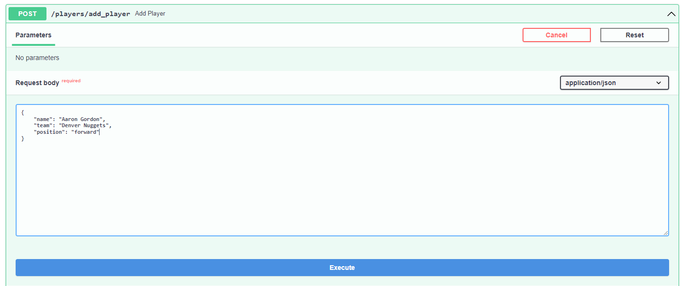

Following the submission we should now see the newly added player to our list:

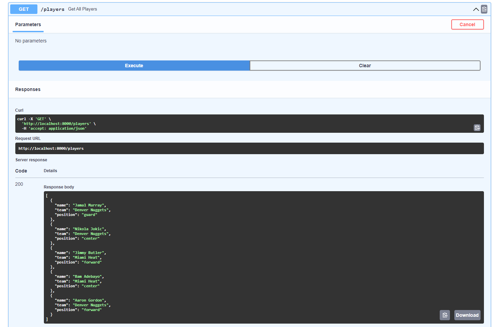

## (PUT) /players/update_player
For the route **"/players/update_player"**, we will be using the **PUT Method to update a player in our list**. 

Below is the **update_player endpoint** defined:
```python
@app.put("/players/update_player")
async def update_player(updated_player=Body()):
    for index in range(len(nba_finals_players)):
        if nba_finals_players[index].get('name').casefold() == updated_player.get('name').casefold():
            nba_finals_players[index] = updated_player
```


Below is the response body we'll be using the update **Bam Adebayo** position from ***center to forward***:
```json
{
    "name": "Bam Adebayo",
    "team": "Miami Heat",
    "position": "forward"
}
```
Here's how you would submit the body via Swagger UI:

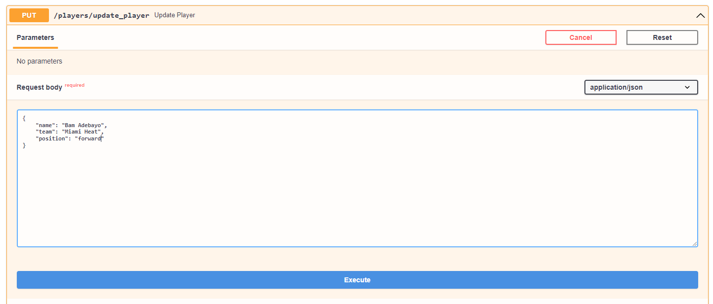

We can see the updates made after executing the **"/players"** route:

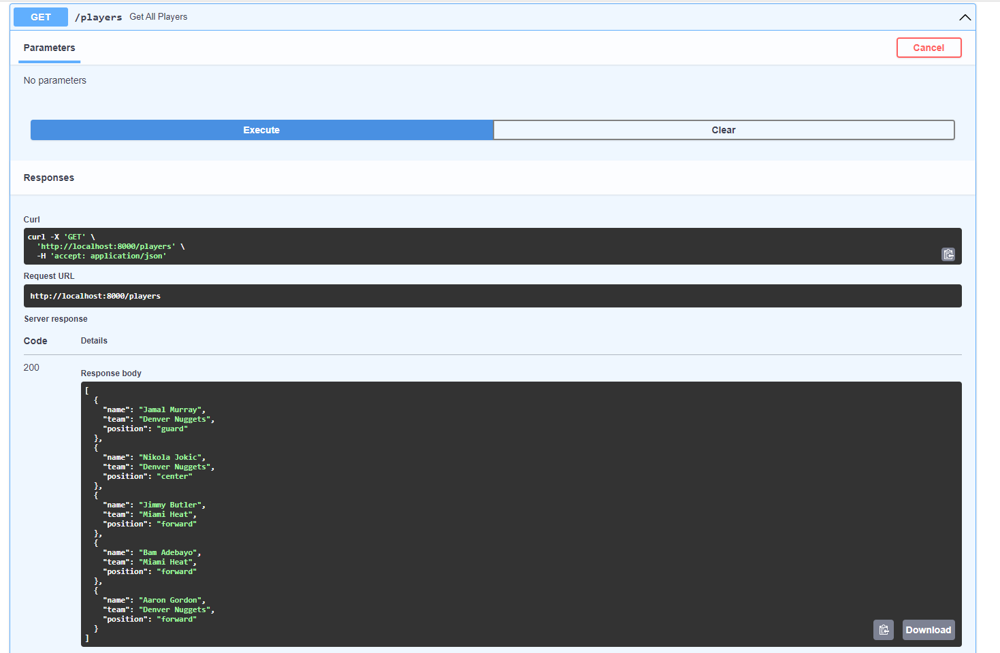

## (DELETE) /players/delete_player/{player_name}
Finally to conclude this project we will be showcasing the "Delete Method" which will remove a player from our list. 

Below is the **delete_player endpoint** defined:
```python
@app.delete("/players/delete_player/{player_name}")
async def delete_player(player_name: str):
    for index in range(len(nba_finals_players)):
        if nba_finals_players[index].get('name').casefold() == player_name.casefold():
            nba_finals_players.pop(index)
            break
```

We'll proceed with deleting **Aaron Gordon** name from our list:

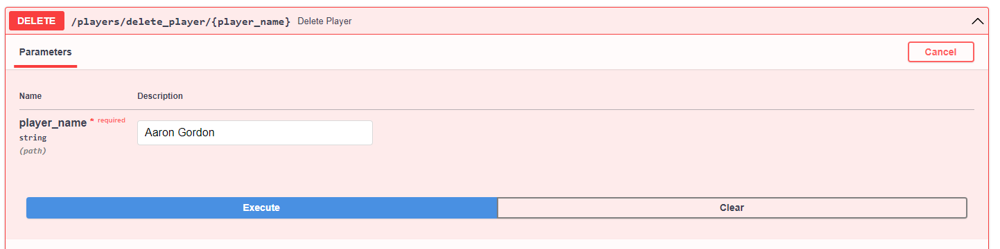

Once we execute the **"/players"** route we should see the deletion reflected in the body response:

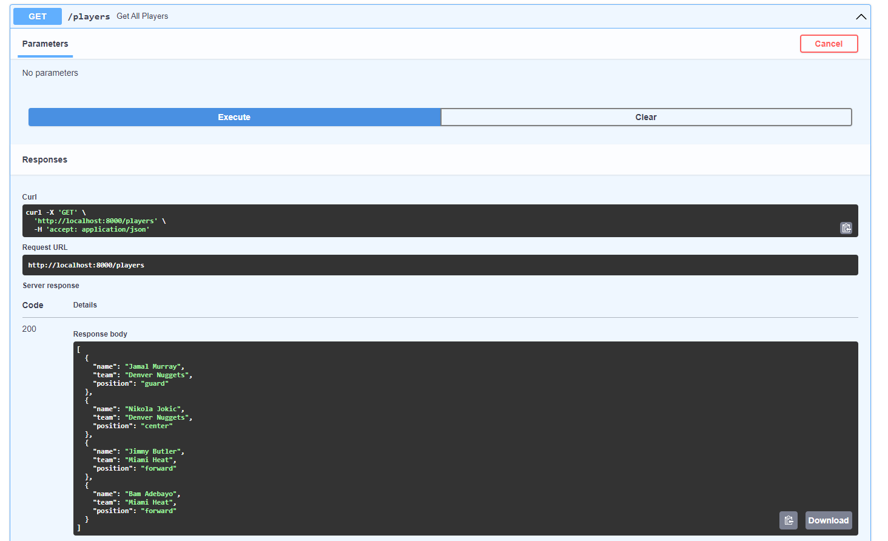