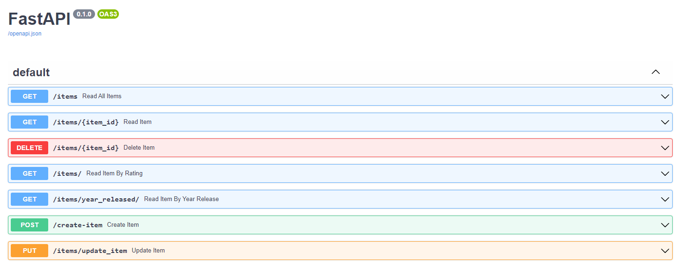

# Pydantics/Data Validation Rules and Status Codes

This project will discuss the Pydantics library for data validation and showcase the use of status codes.  
For this project, we will be using a Python list called **STORE** which will hold a list of **StoreItem objects**:

```python
STORE = [
    StoreItem(1, 'Standing Computer Desk', 499.99, 'A mobile standing computer desk with wheels', 5, 2020),
    StoreItem(2, 'Black L-Shaped Sofa', 799.99, 'Big L-Shaped Sofa with cup holders built-in', 4, 2021),
    StoreItem(3, 'Floor Living Room Lamp', 99.99, 'Tall living room lamp', 3, 2022),
    StoreItem(4, 'Dining Room Table', 399.99, 'A simple dining room table', 2, 2015),
    StoreItem(5, 'Home Office Desk Chair', 299.99, 'A black office desk chair for home', 5, 2020)
]
```

Below is the **StoreItem** class defined along with a constructor to initialize the object:
```python
class StoreItem:
    id: int
    name: str
    cost: float
    description: str
    rating: int 
    year_release: int 

    def __init__(self, id, name, cost, description, rating, year_release):
        self.id = id
        self.name = name
        self.cost = cost
        self.description = description
        self.rating = rating
        self.year_release = year_release
```

Here are all the routes we will be working with in this project:

* (GET) /items
* (GET) /items/{item_id}
* (DELETE) /items/{item_id}
* (GET) /items/
* (GET) /items/year_released/
* (POST) /create-item
* (PUT) /update_item



## Pydantics and Data Validation
Pydantics is a library that is used for data validation and how to handle data coming to our FastAPI app.  
To use pydantic in your app, add the following in your app file: `from pydantic import BaseModel, Field`  
We will be using the **"BaseModel"** from the Pydantic library to assist us with validating the variables within the object itself:
```python
class ItemRequest(BaseModel):
    id: Optional[int] = Field(name='id is not needed')
    name: str = Field(min_length=3)
    cost: float = Field(gt=0.0)
    description: str = Field(min_length=1, max_length=100)
    rating: int = Field(gt=1, lt=6)
    year_release: int = Field(gt=1999, lt=2031)
```
The snippet above will help us with data Validation. Should the incoming request to **create/update** an item match our validations in-place, then we can transform it into a **StoreItem** object. Thus allowing us to **add/update an item** to our STORE list. 

### Deeper look at the validations rules 
Let's examine the fields closely:
* id: Is set to being Optional, meaning it does not need to be included in the request body
* name: Is a string type and for the Field validation it must be minimum 3 characters
* cost: Is of type float and the value has to greater than 0.0
* description: Is of type string and the number of characters has to be between 1 and 100
* rating: Is of type int and the value has to be between 1 and 5
* year_release: Is of type int and the value is between 1999 and 2031


### Status Codes
Status Codes are a set of standards on how a client/server handle the result of a request. It provides context to the submitter whether they're request was successfulr or not. 

For the focus of this project, we'll be looking at some of the 200 and 400 series status codes:
* 200 (OK) - The response for a successful request. Used with "GET" request when data is being returned. 
* 201 (CREATED) - The response for a successful creation of a new resource. 
* 204 (NO CONTENT) - The response is generated for a successful execution. 
                     However, the submitter is not creating a resource, nor is there data being returned. 
                     This status code is typically used with PUT requests. 
* 400 (BAD REQUEST) - Unsuccessful in processing the request due to a client error. Used for invalid request methods. 
* 401 (UNAUTHORIZED) - The client does not have valid authentication for target resource. 
* 404 (NOT FOUND) - The requested resource cannot be found.
* 422 (UNPROCESSABLE ENTITY)- Semantic errors in client request.


### Creating and Updating an item
Let's look at the two endpoints **create_item** and **update_item**:
```python
@app.post("/create-item", status_code=status.HTTP_201_CREATED)
async def create_item(item_request: ItemRequest):
    new_item = StoreItem(**item_request.dict())
    STORE.append(find_item_id(new_item))


@app.put("/items/update_item", status_code=status.HTTP_204_NO_CONTENT)
async def update_item(item: ItemRequest):
    item_changed = False
    for i in range(len(STORE)):
        if STORE[i].id == item.id:
            STORE[i] = item 
            item_changed = True
    if not item_changed:
        raise HTTPException(status_code=404, detail='Item not found!')
```

The "create_item" endpoint has the parameter "item_request" which is of type "ItemRequest" from our BaseModel class. Should the response body fit the validations set, then a new object of type StoreItem will be created and a status 201 will be displayed `status.HTTP_201_CREATED`.


For the "update_item" endpoint, we loop through the STORE list and verify if we have the matching item id based on the submission body. If the item id is a match, then we take the body request and assign it to the current value id matched during the loop phase. We use the item_changed as a flag variable to indicate the change being done. The status code displayed will be 204: `status.HTTP_204_NO_CONTENT`.