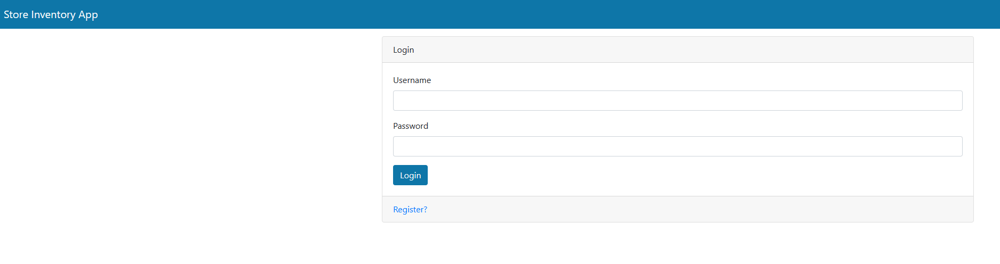
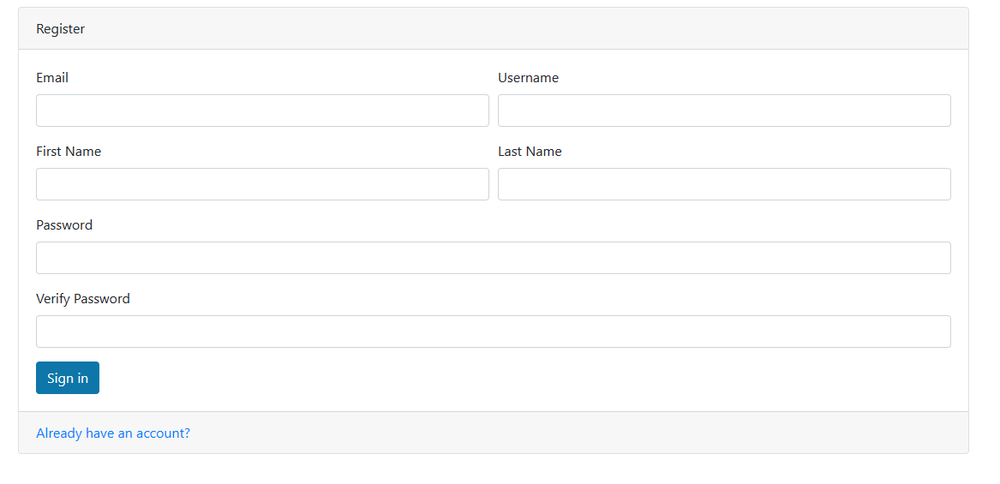
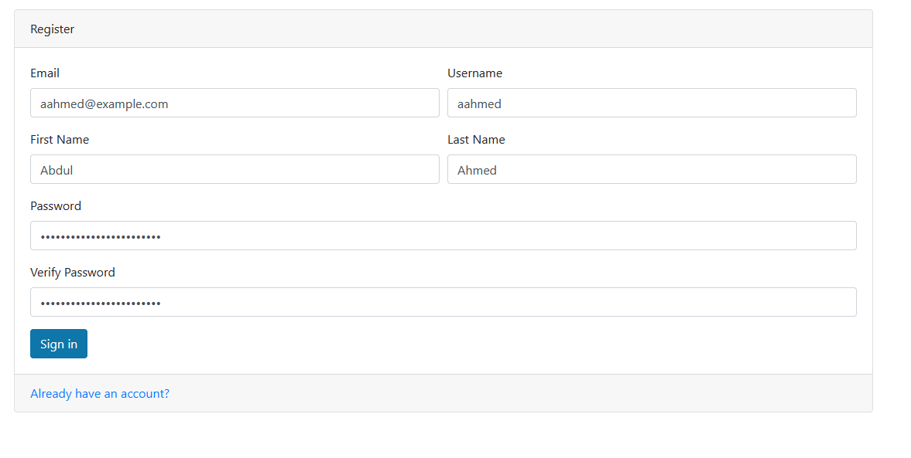
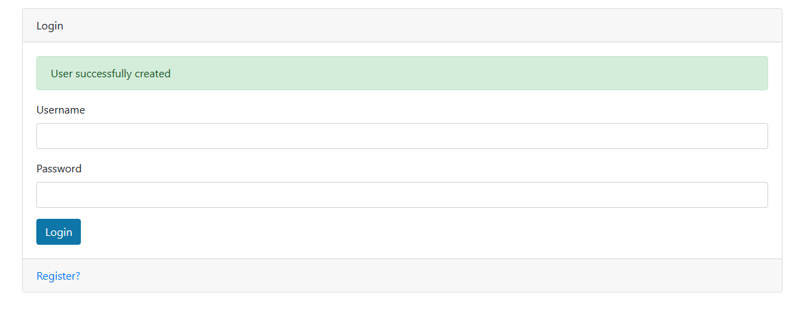
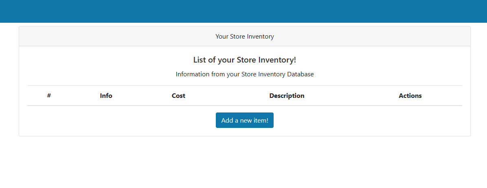
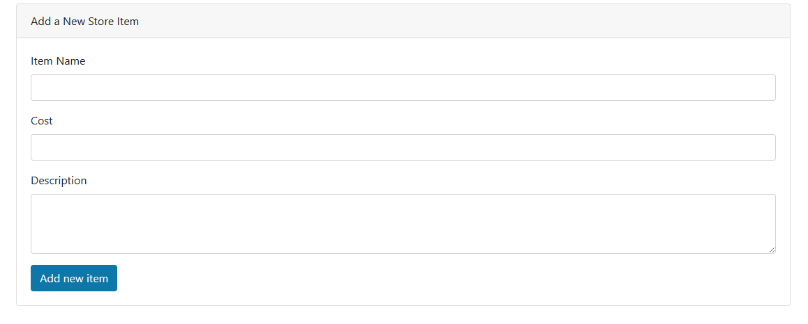
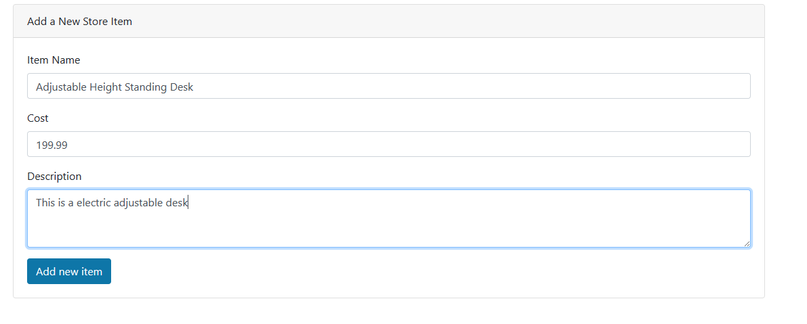
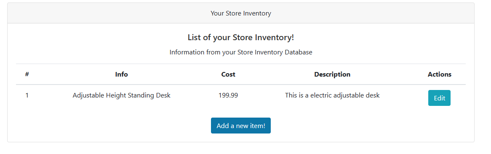
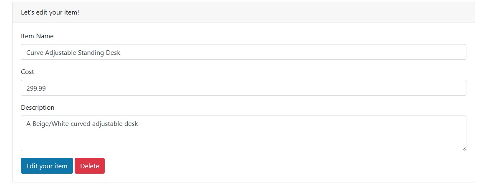
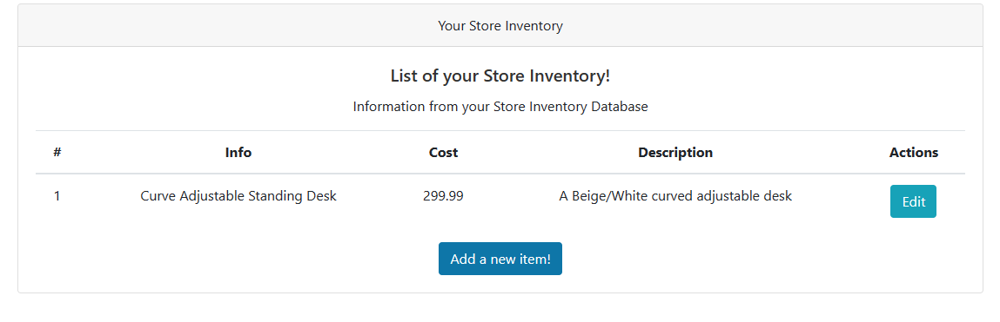

# Store Inventory App

The Store Inventory App allows a user to create a new user account and then allows them to interact with their own store inventory. 
Initially the inventory will be empty for first-time users. However they will have the ability to proceed with adding items in their
own inventory. 

The purpose of this application is to offer a simple user interface to interact with the API constructed as an alternative to doing tests with Swagger's UI. In essence this is a full-stack application storing the inventory data into PostgreSQL.

## Login
We will first start with our login page:



This will be the starting point when accessing the application via: `localhost:8000/store`  

We will need to proceed with creating a new user account. Thus, we will click on **Register?**:

## Registration 



We will need to enter some standard information for our account setup:



Following that we click the **Sign in** button and we should see a ***successful user account created*** message:



## Home 
Here's a preview of our home page:


As you can see our inventory is empty. So we need to proceed with adding items. 

## Adding Item

We will now click "Add a new item" button and we should see this:



Now we will enter some info about our first item to add:



Once we click the "Add new item" button, we should see this output on our home page:



## Editing an Item

We have the function to edit items in our inventory. Proceed with clicking the edit button and make your changes, like so:



Below is the post request for the edit operation defined:
```python
@router.post("/edit-item/{item_id}", response_class=HTMLResponse)
async def edit_item_commit(request: Request, item_id: int, item_name: str = Form(...),
                           cost: float = Form(...), description: str = Form(...),
                           db: Session = Depends(get_db)):

    user = await get_current_user(request)
    if user is None:
        return RedirectResponse(url="/auth", status_code=status.HTTP_302_FOUND)

    store_model = db.query(models.Items).filter(models.Items.id == item_id).first()

    store_model.item_name = item_name
    store_model.cost = cost
    store_model.description = description
    
    db.add(store_model)
    db.commit()

    return RedirectResponse(url="/store", status_code=status.HTTP_302_FOUND)
```

Once you click "Edit your Item" button, the changes will be saved and overwrite wants being stored in Postgres.  
The changes are reflected over in your home page:




### Deletions
To delete the item, just simply click the edit button via home page and on the edit page, click **Delete**.  
From there the record will be deleted from Postgres and will no longer be viewable from the Home Page. 

Below is the **delete_item** endpoint defined:
```python
@router.get("/delete/{item_id}")
async def delete_item(request: Request, item_id: int, db: Session = Depends(get_db)):

    user = await get_current_user(request)
    if user is None:
        return RedirectResponse(url="/auth", status_code=status.HTTP_302_FOUND)

    item_model = db.query(models.Items).filter(models.Items.id == item_id)\
        .filter(models.Items.owner_id == user.get("id")).first()

    if item_model is None:
        return RedirectResponse(url="/Items", status_code=status.HTTP_302_FOUND)

    db.query(models.Items).filter(models.Items.id == item_id).delete()

    db.commit()

    return RedirectResponse(url="/store", status_code=status.HTTP_302_FOUND)
```